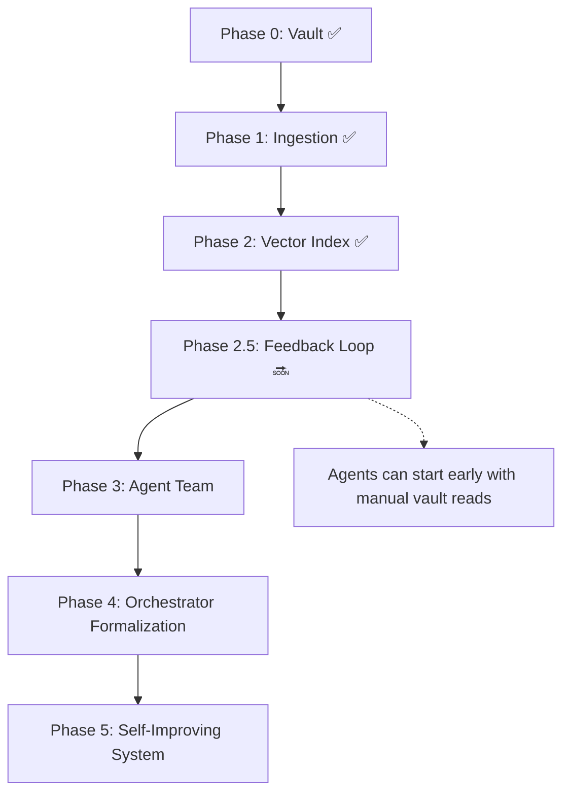

# AGENT-OS-PLAN — Revised After Video Analysis

**Reference:** "Build Your Own Agent Operating System" (Julian, 2026)  
**Original plan:** AGENT-OS-PLAN.md  
**Revision date:** 2026-05-28

---

## What We Got Right (Validated)

| Video's Insight | Our Implementation | Verdict |
|-----------------|-------------------|---------|
| Obsidian is the best memory layer | `TrueVow_Knowledge/` vault | ✅ Nailed it |
| Memory is the most important layer | Phase 0 + 1 focused on vault | ✅ Correct priority |
| Plain markdown, local-first | All `.md` files, no lock-in | ✅ |
| Agents write AND read from vault | I write session logs + ADRs + Incidents | ✅ Partial |
| Skip n8n (no automation plumbing) | Build direct agent-to-knowledge | ✅ We never went near n8n |
| Every output needs a home | `Session-Logs/`, `Incidents/`, `ADRs/` | ✅ |
| Architecture survives tool changes | Vault is model-agnostic | ✅ |
| The loop layer is most skipped | Feedback Master was planned last | ⚠️ Was planned last, should be mid |

## What We Should Change

### 1. The Feedback Loop Must Be Built BEFORE Agents (not after)

The video's key insight: **every output writes back to memory → every new interaction gets smarter**. This is the flywheel.

**Old plan:** Phase 5 (last)  
**New plan:** Phase 2.5 (after indexing, before agents)

Why: Without the loop wired in first, agents (Phase 3) would produce outputs that vanish. We'd lose the compounding improvement.

### 2. Add OMI-Like Auto-Capture

The video uses OMI (wearable) to record screen+mic → transcribe → Obsidian.

**Our OMI equivalent (no hardware needed):**

| Their OMI | Our Auto-Capture |
|-----------|-----------------|
| Records screen | `knowledge-sync` git ingestion |
| Records mic | Agent session transcripts (me) |
| Transcribes | Structured markdown via templates |
| Exports to Obsidian | Direct write to `TrueVow_Knowledge/` |

**Gap to close:** Every agent session must auto-log. Not after-the-fact — inline, as work happens. I already do this partially, but should formalize:
- Start of session: read vault for context
- During session: log decisions + blockers inline
- End of session: flush summary to `Session-Logs/`

### 3. The "Dashboard" is Obsidian's Graph View

The video uses a custom Next.js dashboard. We don't need that — Obsidian's built-in **graph view** + **Dataview plugin** + **Kanban plugin** gives us the same:

| Their Dashboard | Our Equivalent |
|----------------|---------------|
| Agent sidebar | Graph view with service nodes |
| Workspace preview | Dataview queries |
| Kanban board | Obsidian Kanban plugin |
| Studio/media gallery | File explorer in Obsidian |

**Cost:** $0. No custom dashboard to build and maintain.

### 4. Per-Service "Agent Harnesses"

The video has dedicated agents per task (SEO, studio, social). We should formalize per-service agents as `.opencode/` subagents:

```
.opencode/agents/
  platform-analytics-agent.md    # Knows ADR-001, Incident-001
  internal-ops-agent.md          # Knows registry deadlock, DB issues
  tenant-app-agent.md            # Knows Voice bridge, scheduler
  feedback-master-agent.md       # Reviews logs, proposes ADRs
```

Each agent:
- Reads relevant vault pages at startup (via vector search)
- Has a specialized system prompt
- Reports back to orchestrator (me)

---

## Revised Build Order



### Phase 2.5 — Feedback Loop (NEW, PRIORITY)

| Component | What | How |
|-----------|------|-----|
| **Auto-log** | Every session auto-writes to vault | Orchestrator writes inline during work |
| **Auto-index** | Vault changes auto-reindex | `npm run index` after every session |
| **Auto-query** | Orchestrator queries vector index on startup | `npm run query -- "context"` before work |
| **Pattern detection** | Review session logs → propose ADRs | Weekly feedback review |

### Phase 3 — Agent Team (Updated)

Instead of building "agents" as abstract concepts, build them as concrete `.opencode/agents/` configs:

```
01-knowledge-agent.md     # Reads vault, answers questions, suggests reads
02-platform-analytics.md  # Specialized in Analytics service
03-tenant-app.md          # Specialized in Tenant Application
04-feedback-agent.md      # Reviews logs, detects patterns, suggests ADRs
```

### Phase 4 — Orchestrator (Updated)

I (this agent) become the orchestrator that:
1. On session start: queries vector index for context → reads relevant vault pages
2. Routes requests to the right subagent (or handles directly)
3. Logs every decision to vault
4. On session end: triggers reindex

### Phase 5 — Self-Improving System

The flywheel:
```
Session work → vault log → reindex → next session has richer context
                                                      ↓
                                             Agents produce better output
                                                      ↓
                                             Patterns detected → ADRs written
                                                      ↓
                                             Service quality improves
```

---

## What I Would Do Differently (Based on Video)

1. **The loop is more important than the agents.** Without it, agents start cold every time. I'll prioritize Phase 2.5 before Phase 3.

2. **Auto-capture everything.** Not just git — every interaction, every decision, every "why." The vault should be the source of truth for *how we work*, not just *what we built*.

3. **Simplify the agent structure.** Instead of 5-7 abstract agents, start with 2-3 concrete `.opencode/agents/` that I actually use daily.

4. **Obsidian IS the dashboard.** No custom UI. The graph view with Dataview queries gives us mission control for free.

---

## Immediate Next Step

Phase 2.5: **Wire the feedback loop first.** The next time I work, I:
1. Auto-query the vault at session start
2. Log inline as decisions are made
3. Auto-append to vault at session end
4. Trigger reindex

This makes **every session smarter** starting right now, before any new agents are built.

---

**Shall I proceed with Phase 2.5 (feedback loop) next?**
