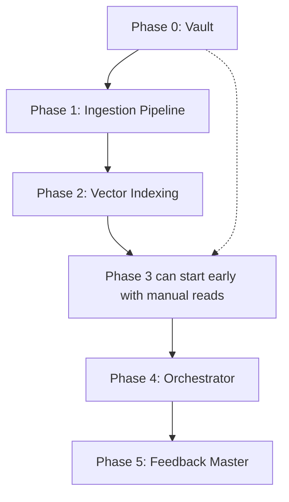

# TrueVow Agent Operating System — Build Plan

**Inspired by:** Omi + Obsidian → 7-layer agent OS  
**Status:** Phase 0 complete (vault scaffolded)  
**Last updated:** 2026-05-28

---

## The 7 Layers

```
┌─────────────────────────────────────────┐
│  Layer 7: Feedback Master               │  ← Evaluates, learns, closes the loop
├─────────────────────────────────────────┤
│  Layer 6: Orchestrator                  │  ← Routes work, maintains context
├─────────────────────────────────────────┤
│  Layer 5: Agent Team                    │  ← Specialized agents (code review, security, etc.)
├─────────────────────────────────────────┤
│  Layer 4: Indexing (Vector + Graph)     │  ← Embeddings, semantic search, entity links
├─────────────────────────────────────────┤
│  Layer 3: Knowledge Storage (Obsidian)  │  ← Structured markdown vault
├─────────────────────────────────────────┤
│  Layer 2: Processing                    │  ← Parse, classify, link incoming data
├─────────────────────────────────────────┤
│  Layer 1: Ingestion                     │  ← Git, sessions, logs, PRs, CI
└─────────────────────────────────────────┘
```

---

## Phase 0 — Foundation ✅ DONE

| What | Status |
|------|--------|
| Obsidian vault at `TrueVow_Knowledge/` | ✅ |
| Templates (ADR, Incident, Session-Log, Service-Map, Decision) | ✅ |
| REPO-MAP.md with all 19 services | ✅ |
| Cross-service dependency map | ✅ |
| `knowledge-sync` ingestion script | ✅ |
| ADR-001 (registry deadlock) seeded | ✅ |
| Incident-001 (DB DNS failure) seeded | ✅ |

---

## Phase 1 — Ingestion + Processing (Layers 1–2)

**Goal:** Automatically capture everything happening across repos into the vault.

### Layer 1: Data Sources

| Source | Method | Frequency |
|--------|--------|-----------|
| Git commits (all 19 repos) | `git log --since` via `knowledge-sync` | Daily cron |
| Agent session transcripts | Auto-append to `Session-Logs/{date}.md` | Per session |
| Orchestrator progress | Write to `ORCHESTRATOR_PROGRESS.md` + vault | Per session |
| CI/test results | Webhook → vault `Incidents/` or `Decisions/` | On failure |
| PRs (GitHub) | `gh pr list` + webhook | On open/merge |
| Dependency changes | `package.json`/`pyproject.toml` diff detection | Daily |

### Layer 2: Pipeline

```
Raw data → Normalize → Classify (type, service, severity) → Link (wiki-links) → Write vault
```

**Implementation:** Extend `knowledge-sync` from a scan-only script to a full pipeline:
- Add `extractors/` — one per data source
- Add `classifier/` — tags content as ADR, Incident, Decision, etc.
- Add `linker/` — finds existing related notes and inserts `[[links]]`

**Deliverable:** Scheduled task (Windows Task Scheduler or npm script) that ingests and writes.

---

## Phase 2 — Indexing (Layer 4)

**Goal:** Make all vault content semantically searchable.

| Component | Choice | Why |
|-----------|--------|-----|
| Embedding model | `text-embedding-3-small` | Cheap, good, 1536d |
| Vector store | Supabase `pgvector` (already have Supabase) | No new infra |
| Chunking | 512-token chunks with 128-token overlap | Balances precision + context |
| Graph | Obsidian built-in + Dataview queries | Already works for structured queries |

**Flow:**

```
Vault .md files → Chunker → Embedder → pgvector (Supabase)
                                           ↓
Orchestrator / Agents ← semantic search ← query
```

**Deliverable:** `shared-libraries/knowledge-indexer/` — a Node.js or Python script that:
1. Walks all `.md` files
2. Chunks by heading + content
3. Embeds via OpenAI API
4. Upserts into Supabase `documents` table with metadata (source file, service, type, date)

---

## Phase 3 — Agent Team (Layer 5)

**Goal:** Specialized agents that consume the knowledge base to produce better outputs.

| Agent | Role | Reads | Writes |
|-------|------|-------|--------|
| **Code Reviewer** | Reviews diffs against known patterns/incidents | ADRs, Incidents | PR comments |
| **Architecture Agent** | Flags when changes violate ADRs or dependency map | ADRs, Cross-Service | ADRs (proposed) |
| **Security Agent** | Scans for secrets, auth issues, injection | Incident patterns | Incidents, PR flags |
| **Testing Agent** | Suggests tests based on change scope + past bugs | Incidents, Session-Logs | Test `TODO`s |
| **Doc Sync Agent** | Detects stale docs and suggests updates | REPO-MAP, Service-Maps | PRs with doc fixes |

**Architecture:** Each agent is a **system prompt** + tool access. No separate infra — they're me with different hats.
- Implemented as subagent configurations (`.opencode/agents/`)
- Each agent gets a tailored prompt that references Phase 2 vector search

---

## Phase 4 — Orchestrator (Layer 6)

**Goal:** Single entry point that routes tasks, maintains cross-session context, and prioritizes.

**Already partially exists** — this agent (me). Formalization needed:

| Capability | Current | Target |
|-----------|---------|--------|
| Session context | Reads `ORCHESTRATOR_PROGRESS.md` | Reads `Session-Logs/` + vector search across all knowledge |
| Task routing | Manual | Automatic: analyze ask → assign to agent subagent |
| Priority | Manual (based on blockers) | + check Incident severity, ADR status, dependency chain |
| Handoff notes | Written to `ORCHESTRATOR_PROGRESS.md` | Written to `Session-Logs/{date}.md` + linked to relevant ADRs |

---

## Phase 5 — Feedback Master (Layer 7)

**Goal:** Close the loop — evaluate outputs, detect patterns, propose improvements.

### Metrics to Track

| Metric | Source | Purpose |
|--------|--------|---------|
| Time from Incident → ADR | Vault dates | Are we learning from mistakes? |
| Recurring issue patterns | Search Incidents by service | Which service needs refactoring? |
| Agent output quality | Manual review → scored in vault | Are agents improving? |
| Knowledge gaps | Sessions where I asked for info not in vault | What to document next |

### Feedback Loop

```
Agent produces output
    ↓
Feedback Master reviews (me, periodically)
    ↓
If pattern detected → propose ADR / update Incident
    ↓
If agent error → update agent prompt / add to knowledge base
    ↓
If missing context → queue ingestion for that data source
```

**Implementation:** A weekly review session + a `Feedback/` directory in the vault with review notes.

---

## Build Order & Dependencies



Each phase builds on the previous but doesn't strictly block it — e.g., agents (Phase 3) can work with manual vault reading before Phase 2 is built.

---

## Decisions Made (2026-05-28)

| Question | Decision | Rationale |
|----------|----------|-----------|
| Vector store | **Local JSON + in-memory cosine similarity** | Zero infra, no DNS dependency, fast at our scale (~10K chunks) |
| Embedding cost | **Go ahead** | Pennies per full reindex — not a constraint |
| Agent implementation | **`.opencode/agents/` subagents** | Native mechanism, each agent = tailored prompt + tool access |
| Scheduling | **Manual `npm run sync` + Windows Task Scheduler** | Simple, no git-hook complexity for now |
| Audio input | **Skip** | Text-only fits code work; revisit if voice notes become useful |
