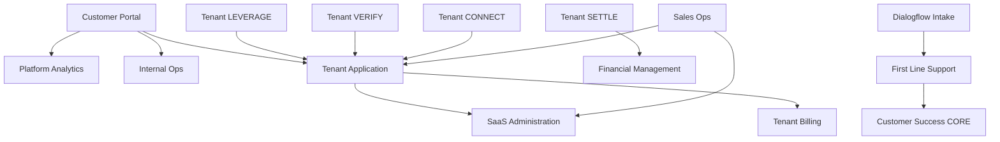

# Service Dependency Map

> High-level data flow and integration points between services.

## Known Broken Links
- **Platform Analytics → Supabase DB** — DNS fails (see [[Incident-001]])
- **Internal Ops → Supabase REST** — port 443 unreachable (same root cause)

## Data Flow Notes
- All services use Supabase as backing store (with direct or REST access)
- Registry pattern exists in Internal Ops but is nascent
- No event bus / message queue exists yet — services call each other via HTTP
